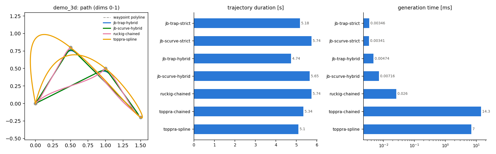
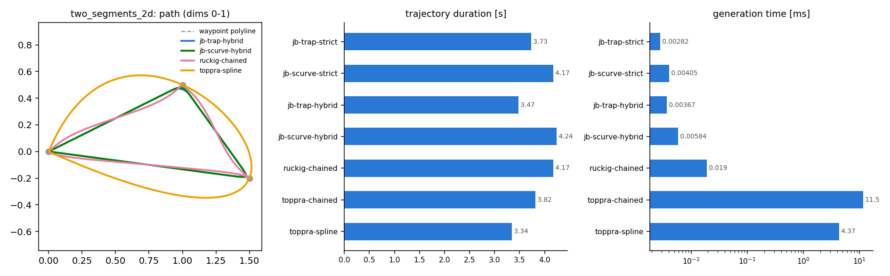
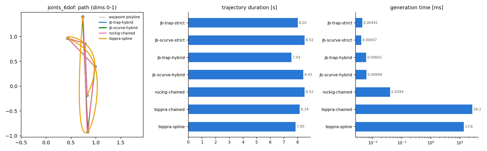

# justblend benchmarks

Comparison of justblend against [ruckig](https://github.com/pantor/ruckig)
(community edition) and [toppra](https://github.com/hungpham2511/toppra) on
shared waypoint scenarios.

**This file is generated** by `benchmarks/run.py`; do not edit it by hand.

## Running

```bash
pip install .[bench,plot]
python benchmarks/run.py [--dt 0.001]
```

## Methods

| method | profile | corner handling | path |
|---|---|---|---|
| jb-trap-strict | trapezoidal | full stop at every waypoint | exact polyline |
| jb-trap-hybrid | trapezoidal | parabolic blends where feasible | polyline with rounded corners |
| jb-scurve-strict | jerk-limited S-curve | full stop at every waypoint | exact polyline |
| jb-scurve-hybrid | jerk-limited S-curve | Hermite blends where feasible | polyline with rounded corners |
| ruckig-chained | jerk-limited | full stop at every waypoint | unconstrained between waypoints (per-axis profiles) |
| toppra-chained | vel/acc time-optimal | full stop at every waypoint | exact polyline |
| toppra-spline | vel/acc time-optimal | passes through waypoints at speed | cubic spline through waypoints |

Intermediate-waypoint support in ruckig is a Pro feature, so the community
edition is chained rest-to-rest per segment. toppra has no jerk constraint.

## Results

### demo_3d (5 waypoints, 3 dof, blend_radius=0.15)

| method | duration [s] | compute [ms] | vel | acc | jerk | polyline dev | wp miss |
|---|---|---|---|---|---|---|---|
| jb-trap-strict | 5.180 | 0.00 | 1.000 | 1.000 | 233.33 | 0.0000 | 0.0000 |
| jb-scurve-strict | 5.736 | 0.00 | 1.000 | 1.000 | 1.00 | 0.0000 | 0.0000 |
| jb-trap-hybrid | 4.738 | 0.00 | 1.000 | 1.000 | 150.00 | 0.0373 | 0.0640 |
| jb-scurve-hybrid | 5.655 | 0.01 | 1.000 | 1.000 | 1.00 | 0.0280 | 0.0480 |
| ruckig-chained | 5.736 | 0.03 | 1.000 | 1.000 | 1.00 | 0.0445 | 0.0000 |
| toppra-chained | 5.340 | 14.31 | 1.000 | 1.000 | 110.83 | 0.0000 | 0.0000 |
| toppra-spline | 5.095 | 7.00 | 1.001 | 1.000 | 99.37 | 0.4942 | 0.0007 |



### two_segments_2d (4 waypoints, 2 dof, blend_radius=0.1)

| method | duration [s] | compute [ms] | vel | acc | jerk | polyline dev | wp miss |
|---|---|---|---|---|---|---|---|
| jb-trap-strict | 3.730 | 0.00 | 1.000 | 1.000 | 239.29 | 0.0000 | 0.0000 |
| jb-scurve-strict | 4.173 | 0.00 | 1.000 | 1.000 | 1.00 | 0.0000 | 0.0000 |
| jb-trap-hybrid | 3.475 | 0.00 | 1.000 | 1.000 | 155.86 | 0.0246 | 0.0459 |
| jb-scurve-hybrid | 4.243 | 0.01 | 1.000 | 1.000 | 1.00 | 0.0185 | 0.0344 |
| ruckig-chained | 4.173 | 0.02 | 1.000 | 1.000 | 1.00 | 0.0329 | 0.0000 |
| toppra-chained | 3.817 | 11.54 | 1.000 | 1.000 | 122.01 | 0.0000 | 0.0000 |
| toppra-spline | 3.344 | 4.37 | 1.001 | 1.000 | 115.78 | 0.2681 | 0.0003 |



### joints_6dof (6 waypoints, 6 dof, blend_radius=0.15)

| method | duration [s] | compute [ms] | vel | acc | jerk | polyline dev | wp miss |
|---|---|---|---|---|---|---|---|
| jb-trap-strict | 8.018 | 0.00 | 1.000 | 1.000 | 4317.20 | 0.0000 | 0.0000 |
| jb-scurve-strict | 8.518 | 0.00 | 1.000 | 1.000 | 1.00 | 0.0000 | 0.0000 |
| jb-trap-hybrid | 7.541 | 0.01 | 1.000 | 1.000 | 132.12 | 0.0372 | 0.0671 |
| jb-scurve-hybrid | 8.423 | 0.01 | 1.000 | 1.000 | 1.00 | 0.0280 | 0.0503 |
| ruckig-chained | 8.518 | 0.04 | 1.000 | 1.000 | 1.00 | 0.0960 | 0.0000 |
| toppra-chained | 8.143 | 26.21 | 1.000 | 1.000 | 91.21 | 0.0000 | 0.0000 |
| toppra-spline | 7.849 | 13.59 | 1.001 | 1.004 | 79.50 | 1.1988 | 0.0005 |



## Metric definitions

- **vel / acc / jerk**: peak per-axis ratio against the corresponding limit
  (<= 1 means the limit is respected). Jerk is finite-differenced from
  sampled accelerations, so large values indicate acceleration steps --
  expected for trapezoidal profiles, parabolic blends, ruckig segment
  boundaries and toppra (no jerk constraint).
- **polyline dev**: max distance from the sampled path to the waypoint
  polyline.
- **wp miss**: worst closest approach to any interior waypoint.

## Reading the numbers

- jb-*-strict and toppra-chained solve the identical polyline-with-stops
  problem. jb-trap-strict is analytically time-optimal there; toppra's grid
  discretisation makes it slightly conservative.
- jb-scurve-strict has matched ruckig-chained's duration on all scenarios to
  date: for straight rest-to-rest legs where the same axis binds the limits,
  the closed-form path profile is per-axis time-optimal.
- ruckig-chained moves each axis independently between waypoints, so its
  path leaves the polyline (see polyline dev) even though it stops at every
  waypoint.
- jb-*-hybrid rounds corners; the deviation is bounded and reported by
  `Trajectory::maxCornerDeviation()`.
- toppra-spline follows a smooth spline through all waypoints without
  stopping: shortest durations, but an unconstrained-jerk, non-polyline
  path.
